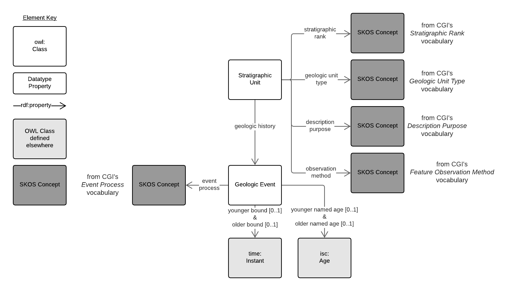

# Stratigraphic Units Ontology
This is a Semantic Web _profile_, that is a specification that is dependent on other specifications.

This profile contains an ontology - the main part of it - which defines the new classes and properties that this profile introduces. It also contains several other parts. For this profile's full description, see:

* **Profile definition** - <http://linked.data.gov.au/def/su>

  
**Figure 1**: Ontology overview  


## Purpose
This is an extremely simple profile whos purpose is only to provide a Semantic Web view of the data contained within the [Australian Stratigraphic Units Database](http://pid.geoscience.gov.au/dataset/ga/21884). Data from that database is also available according to a number of other profiles, including:

* **[GeoSPARQL](https://www.ogc.org/standards/geosparql)** - a simple spatial ontology providing Feature/Geometry views of geospatial things
  * `Feature` instances described in the SU DB do not have geometries as they inherit these from the gelogical provinces they are parts of. As a result, the GeoSPARQL view of SU DB objects is very limited but retained for system compatibility purposes
* **Loop3d** - a powerful geoscience domain ontology describing Stratigraphic Units and other geological entities in detail and with sufficient ontological axioms for advanced reasoning


## License  
This code is licensed using the [Creative Commons 4.0](https://creativecommons.org/licenses/by/4.0/) licence. See the [LICENSE file](LICENSE) for the deed. 

Note [Citation](#citation) below for attribution.


## Citation
To cite this profile, please use the following BibTex:

```
@techreport{linked.data.gov.au-def-su,
  author = {{Nicholas J. Car}},
  title = {Stratigraphic Units Ontology},
  date = {2020},
  publisher = "Geoscience Australia",
  url = {https://linked.data.gov.au-def-su}
}
```


## Contacts

*owner*:  
**Will Francis**  
*Data Architect*  
Geoscience Australia  
<william.francis@ga.gov.au>  
 
*ontology & profile creator:*  
**Dr Nicholas J. Car**  
*Data Systems Architect*  
SURROUND Australia Pty. Ltd.  
<nicholas.car@surroudaustralia.com>  
